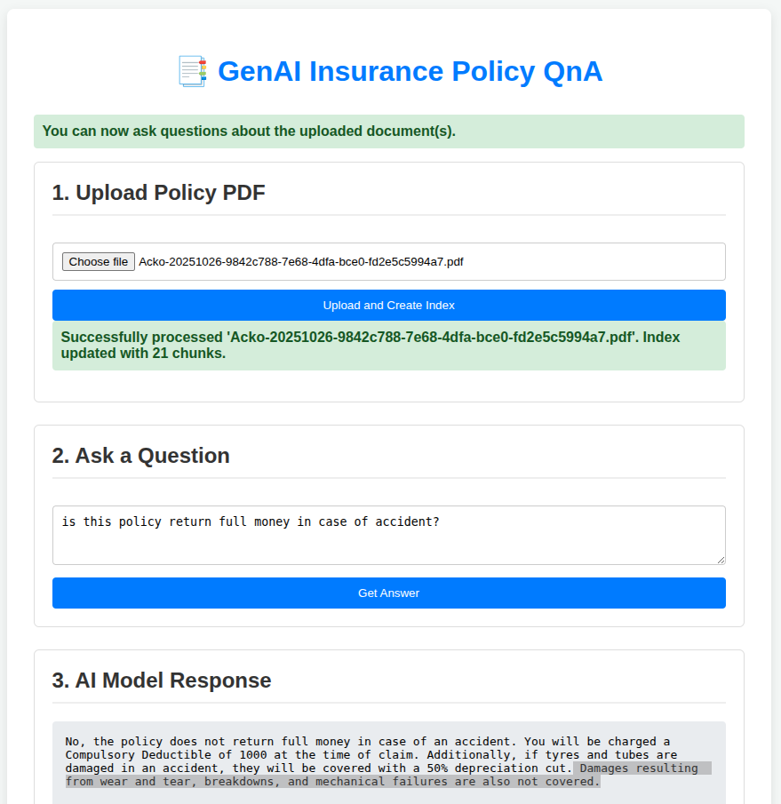

# 🧠 Insurance Gemini Assistant

A Generative AI-powered chatbot that understands your insurance policies.  
Upload an insurance PDF, ask questions in natural language, and get instant, accurate answers — powered by **Google Gemini** and **LangChain**.

---



## 🚀 Features

- 📝 **PDF Upload:** Upload any insurance policy document.  
- 🔍 **Smart Understanding:** Extracts and embeds your PDF data for contextual understanding.  
- 💬 **Ask Anything:** Get precise answers about coverage, exclusions, claim process, and more.  
- ⚙️ **LangChain + FAISS:** Uses vector embeddings for fast and accurate context retrieval.  
- 🌐 **Built with Flask (or Django):** Lightweight backend for serving your AI queries.

---

## 🧩 Tech Stack

| Component | Technology |
|------------|-------------|
| Frontend | HTML, CSS, JavaScript |
| Backend | Flask / Django |
| LLM | Google Gemini API |
| Embeddings | Google Generative AI Embeddings |
| Vector Store | FAISS |
| File Handling | LangChain Document Loaders |
| Environment | Python 3.10+ |

---

---

## 🧠 How It Works

1. **Upload PDF** – The insurance document is parsed using LangChain PDF loaders.  
2. **Chunk + Embed** – The text is split into small chunks and converted to embeddings.  
3. **Store in FAISS** – The embeddings are indexed for fast vector search.  
4. **Ask Gemini** – Your question + top relevant chunks are passed to Gemini for response.  
5. **Answer Displayed** – The assistant shows concise, context-aware answers.

---

## ⚙️ Setup Instructions

```bash
# Clone the repository
git clone https://github.com/yourusername/insurance-gemini-assistant.git
cd insurance-gemini-assistant

# Create a virtual environment
python -m venv env
source env/bin/activate

# Install dependencies
pip install -r requirements.txt

# Add your API key
export GOOGLE_API_KEY="your_google_gemini_key"

# Run the app
python app.py


